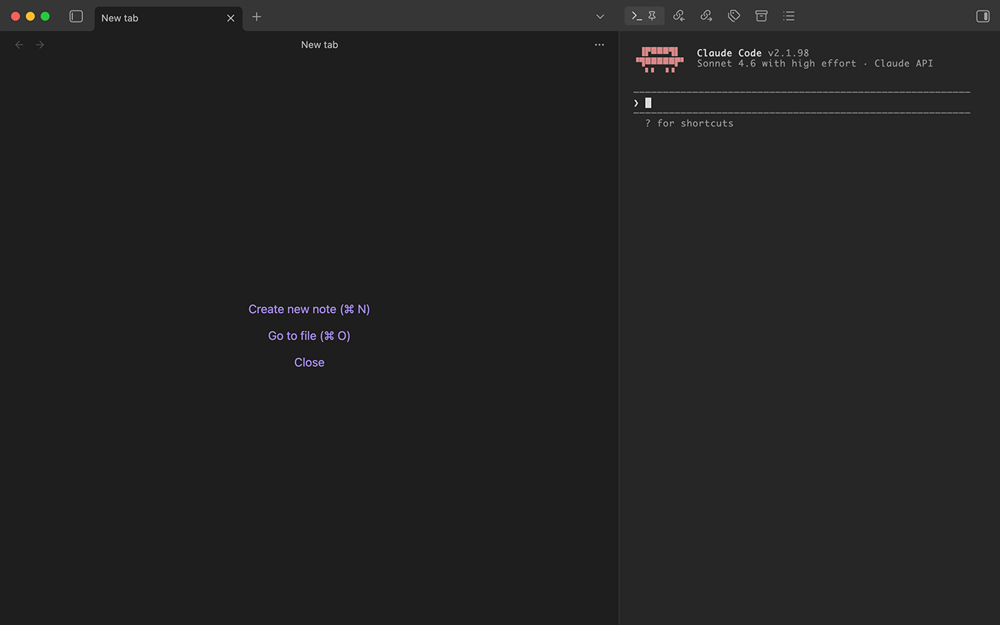

<div align="center">

# 🤖 Claude Subscription

### Run Claude Code in Obsidian's sidebar under your personal subscription.

[](https://obsidian.md)
[](#compatibility)
[](./LICENSE)
[](#status)

<sub>One-click bootstrap for the setup described in the "Claude Code в Obsidian" guide: isolated OAuth token, Keychain storage, and a terminal pane that starts Claude ready to use.</sub>

</div>

---



## Why this plugin exists

Anthropic has restricted third-party wrappers around the subscription-based OAuth flow. The safe way to use your personal Pro subscription inside Obsidian is to run the **official** `claude` CLI through a thin setup that isolates its credentials and config from any other installations. The guide that describes this setup is ~10 manual steps — this plugin automates them.

No custom frontend. No direct API calls. No token reuse across machines. Same HTTP traffic as running `claude` in any terminal.

## Status

**Alpha / scaffold.** The repository currently contains the plugin skeleton and documentation. The functional layers (OAuth capture, Keychain I/O, wrapper generation, terminal view) land in upcoming commits.

## Planned functionality

1. **Setup assistant.** Walk through:
   - Detect / install Claude Code CLI (`brew install anthropic/claude-code/claude-code`).
   - Run `claude auth login` in an isolated `CLAUDE_CONFIG_DIR` and `claude setup-token`.
   - Store the token in a **named** Keychain slot (not the shared `Claude Code-credentials` one).
   - Log out of the isolated session so the slot stays empty.
2. **Terminal view.** An xterm-powered pane that spawns `claude` as a child process with the right env vars:
   - `CLAUDE_CONFIG_DIR=~/.claude-personal`
   - `CLAUDE_CODE_OAUTH_TOKEN=<from Keychain>`
3. **Settings.** Change the Keychain slot name, rotate the token, toggle auto-start, pick working directory.
4. **Commands.** Quick palette entries: focus terminal, start new session (`/clear`), resume last session.

## Installation (future)

```bash
git clone https://github.com/fougaser/obsidian-claude-subscription.git
cd obsidian-claude-subscription
npm install
npm run build
```

Symlink the three artifacts into your vault's `.obsidian/plugins/obsidian-claude-subscription/`:

```bash
ln -s "$PWD/main.js"       <vault>/.obsidian/plugins/obsidian-claude-subscription/main.js
ln -s "$PWD/manifest.json" <vault>/.obsidian/plugins/obsidian-claude-subscription/manifest.json
```

Enable in `Settings → Community plugins`.

## Compatibility

- **macOS only (for now).** Keychain integration (`security` CLI), Homebrew path assumptions (`/opt/homebrew/bin/claude`).
- **Obsidian 1.5+**.

## Safety & trademarks

This plugin uses the **official** `claude` binary with its own documented env vars. No redistribution of Anthropic code, no proxying, no mimicry. Still, honest caveats apply:

- Don't share your OAuth token.
- Don't automate high-QPS bot-like loops — the subscription is for interactive use.
- Anthropic policy can change. Use at your own risk.

Treat this plugin as a **setup automator**, not a wrapper or a service.

## License

[MIT](./LICENSE) © fougaser.
